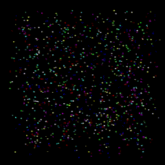

# ISAE-Supaero - IN101 Project : Clash of Particles

Here is a basic implementation of particles movement and elastic collisions within a confined box.

You can find two implementation :
* A naive implmentation of the collisions management.
* A more complex implementation using a binary heap data structures in order to reduce the complexity and thus improve performances for a larger numbers of particles.

On top of that there is a script which calculate an approximation of PI in link with the number of collisions between 2 particles. (See [this video by 3Blue1Brown](https://www.youtube.com/watch?v=HEfHFsfGXjs)).

## Visualisation 

<p align="center">
  <table>
    <tr>
      <td align="center">
        <br/>
        <b>Naive simulation for 100 particles</b>
      </td>
      <td align="center">
        <br/>
        <b>Naive simulation for 500 particles</b>
      </td>
      <td align="center">
        <br/>
        <b>Naive simulation for 1000 particles0</b>
      </td>
    </tr>
  </table>
</p>

<p align="center">
  <table>
    <tr>
      <td align="center">
        <br/>
        <b>Binary heap simulation for 100 particles</b>
      </td>
      <td align="center">
        <br/>
        <b>Binary heap simulation for 1000 particles</b>
      </td>
      <td align="center">
        <br/>
        <b>Binary heap simulation for 2000 particles0</b>
      </td>
    </tr>
  </table>
</p>


## Commands

To compile the files:
```console
foo@bar:~$ make clean
foo@bar:~$ make clash-of-particles-naive
foo@bar:~$ make clash-of-particles-bh
foo@bar:~$ make calculate-pi-coll
```

You can then run these scripts with:
```console
foo@bar:~$ ./calculate-pi-coll
```

```console
foo@bar:~$ ./clash-of-particles-naive data/random-(number of particles).txt
```

```console
foo@bar:~$ ./clash-of-particles-bh data/random-(number of particles).txt
```
